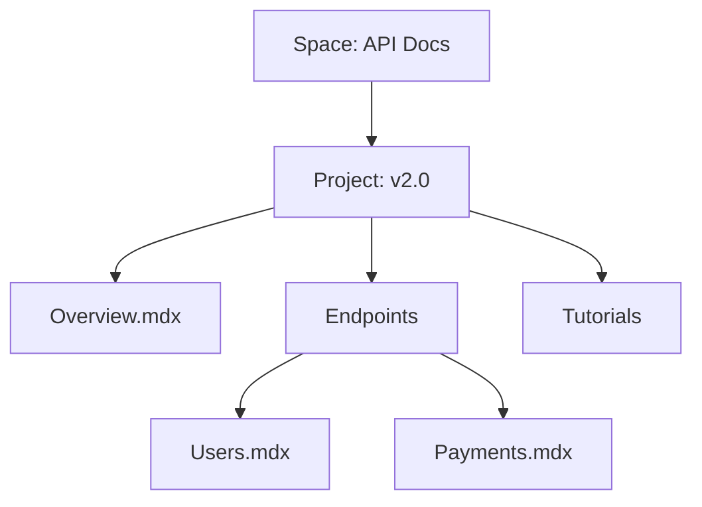

## Overview

Mundo Digital provides a flexible documentation platform where you organize content into spaces and projects. Master these core concepts to build scalable documentation hierarchies, manage teams efficiently, and control access precisely. Start by familiarizing yourself with spaces, organization strategies, and collaboration tools.

<Columns cols={3}>
  <Card title="Spaces & Projects" icon="database" href="#documentation-spaces">
    Group related documentation into isolated spaces with projects for versioned content.
  </Card>
  <Card title="Organization" icon="layout" href="#content-organization">
    Structure pages with hierarchies, tags, and navigation for intuitive access.
  </Card>
  <Card title="Collaboration" icon="users" href="#collaboration">
    Invite teams, assign roles, and enforce granular permissions.
  </Card>
</Columns>

## Documentation Spaces and Projects

Spaces act as top-level containers for your documentation. Create a space for each major initiative, such as "API Reference" or "User Guides". Within spaces, projects manage versions—like `v1.0` or `beta`—enabling parallel development without conflicts.

Follow these steps to set up your first space:

<Steps>
  <Step title="Create a Space" icon="plus">
    Navigate to the dashboard and select "New Space". Enter a name like "Mundo Digital API Docs" and a description.
  </Step>
  <Step title="Add a Project" icon="folder">
    Inside the space, click "New Project". Name it "stable" and set it as default.
  </Step>
  <Step title="Publish Preview" icon="eye">
    Generate a preview URL to share drafts before going live.
  </Step>
</Steps>

<Callout kind="tip">
  Use descriptive names for spaces to reflect their purpose, such as "Internal Onboarding" versus "Public SDK Guide".
</Callout>

## Content Organization and Hierarchies

Organize pages using nested hierarchies for logical navigation. Pages support frontmatter, MDX components, and custom metadata. Tags enable cross-linking and search.

<Expandable title="Hierarchy Best Practices" default-open="false">

Maintain a clear structure:

| Level | Example Path | Purpose |
|-------|--------------|---------|
| Space | `/api-docs` | Top-level grouping |
| Project | `/api-docs/v2` | Version isolation |
| Page | `/api-docs/v2/endpoints/users` | Specific content |
| Section | `/api-docs/v2/endpoints/users#get-user` | Anchored details |

</Expandable>

Visualize a typical hierarchy:



<Tabs>
  <Tab title="Flat Structure" icon="grid">
    Ideal for small docs. All pages at root level with tags for grouping.
  </Tab>
  <Tab title="Nested Hierarchies" icon="layers">
    Use folders for deep navigation. Supports automatic sidebar generation.
  </Tab>
</Tabs>

## Collaboration and Access Controls

Invite team members to spaces and assign roles: Admin, Editor, Viewer. Admins manage everything; Editors publish pages; Viewers read-only access.

<CodeGroup tabs="YAML Config,CLI">
```yaml
# space-config.yaml
space:
  name: "API Docs"
  permissions:
    - role: admin
      users: ["alice@example.com"]
    - role: editor
      groups: ["dev-team"]
```
```bash
# mdd space invite --space api-docs --user bob@example.com --role editor
mdd space update-permissions --config space-config.yaml
```
</CodeGroup>

<Tabs>
  <Tab title="Role Permissions" icon="shield">
    
| Role | Edit Pages | Publish | Manage Users |
|------|------------|---------|--------------|
| Admin | Yes | Yes | Yes |
| Editor | Yes | Yes | No |
| Viewer | No | No | No |

  </Tab>
  <Tab title="Advanced Controls" icon="settings">
    Set page-level locks, branch protections, and webhook integrations for CI/CD.
  </Tab>
</Tabs>

<Callout kind="alert">
  Regularly review access logs to ensure compliance with your security policies.
</Callout>

These concepts form the foundation. Apply them to streamline your documentation workflow and scale with your projects.