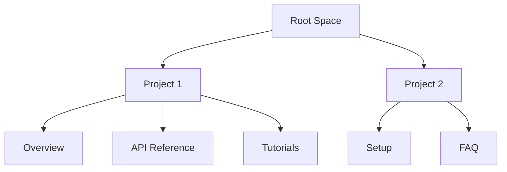

## Overview

Mundo Digital Documentation provides a centralized space for your project docs. You create, organize, and collaborate on documentation with teams. Build hierarchical structures, add rich content, and publish instantly. Access everything through intuitive search and navigation.

## Key Features

Mundo Digital offers powerful tools to streamline your documentation workflow.

<Columns cols={3}>
  <Card title="Hierarchical Organization" icon="folder-tree" href="/docs/organization">
    Create nested pages and sections. Manage large projects with ease.
  </Card>
  <Card title="Real-Time Collaboration" icon="users" href="/docs/collaboration">
    Edit docs together with live previews and version history.
  </Card>
  <Card title="Advanced Search" icon="search" href="/docs/search">
    Find content instantly across your entire documentation space.
  </Card>
</Columns>

<Columns cols={2}>
  <Card title="Custom Branding" icon="palette" href="/docs/branding">
    Apply your brand colors like `#3B82F6` and logos.
  </Card>
  <Card title="Embed & Share" icon="share-2" href="/docs/embed">
    Generate embeds for blogs, wikis, or internal tools.
  </Card>
</Columns>

<Callout kind="tip">
  Start with the quick setup to import existing Markdown files in under 2 minutes.
</Callout>

## Navigating Your Documentation Space

Follow these steps to get oriented quickly.

<Steps>
  <Step title="Explore the Sidebar" icon="sidebar">
    Use the left sidebar for navigation. Click sections to expand subsections.
  </Step>
  <Step title="Search Content" icon="search">
    Press `<kbd>Ctrl</kbd>+<kbd>K</kbd>` or use the top search bar to find pages.
  </Step>
  <Step title="Customize View" icon="settings">
    Pin frequently used pages and toggle dark mode from the user menu.
  </Step>
</Steps>

## User Roles and Permissions

Access levels differ by role. Switch views to see differences.

<Tabs>
  <Tab title="Admin" icon="shield">
    Full access: Create, edit, delete, and manage users.

    ```javascript
    // Admin API example
    const response = await fetch('/api/docs/admin', {
      headers: { Authorization: `Bearer YOUR_API_TOKEN` }
    });
    ```
  </Tab>
  <Tab title="Editor" icon="edit-3">
    Edit and organize content without user management.

    ```javascript
    // Editor embed code
    embedDocs('project-section', { theme: 'light' });
    ```
  </Tab>
  <Tab title="Viewer" icon="eye">
    Read-only access with search and comments.

    <Callout kind="info">
      Viewers can suggest edits via comments.
    </Callout>
  </Tab>
</Tabs>

## Embed Mundo Digital in Your Apps

Integrate docs into your tools with simple snippets.

<CodeGroup tabs="JavaScript,React">
  ```javascript
  // Vanilla JS embed
  const embed = document.createElement('iframe');
  embed.src = 'https://docs.mundodigital.com/embed/your-space';
  embed.width = '100%';
  embed.height = '600';
  document.body.appendChild(embed);
  ```
  ```jsx
  // React component
  import { DocsEmbed } from '@mundo-digital/embed';

  function App() {
    return (
      <DocsEmbed
        spaceId="your-space-id"
        height={600}
        theme="auto"
      />
    );
  }
  ```
</CodeGroup>

## Document Structure



<Expandable title="Advanced Navigation Tips" default-open="false">
  Use breadcrumbs for quick backtracking. Bookmark pages with the star icon. Export sections as PDF via the three-dot menu.
</Expandable>